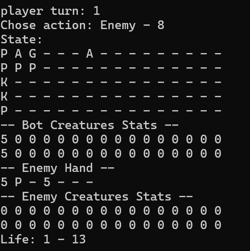

# Magic The Gathering: Arena MCTS Bot

Fork from the Open Spiel Open Source project, colaborative reserach project to create a Magic The Gathering: Arena Bot using Monte Carlo Tree Search, orginally attempted with MuZero, now using Open Spiel due to model complexity, reliability and memory efficiency.

Current contributors:

* Alexander Quesada Quesada - UCR - alexander.quesadaquesada@ucr.ac.cr
* Frank Wang - University of Toronto - broodstar_frank@hotmail.com

## How to run pilot simulation

1. Clone this repository
2. Navigate to open_spiel/open_spiel/examples/examples
3. Run `make mtg`
4. You can now run and see a simulation of the game, we recommend running:

` ./mtg --max_simulations=20 --num_games=1 --player2=random --verbose=false --quiet=false`

This will run a single game with the first player (the target bot) being the MCTS bot and second player as random action chooser, in each state of the game it will run 20 simulations (you can see the reward / outcome mapping for each possible action by setting `--verbose=true`).

## Captures and explanation

This current pilot version uses a matrix structure of the game:

### Visible information of the state

- The first row represents 7 cards in bot's hand (in this example it only has 4) and 9 empty slots.
- The second row represents up to 16 lands on the bot's side of the arena
- The third row represents up to 16 creatures on the bot's side of the arena
- The fourth row represents up to 16 creatures on the enemy's side of the arena
- The fifth row represents up to 16 lands on the enemy's side of the arena

* Bot / Enemy creature stats represents the power (first row) and toughness (second row) of the current creatures on the arena.

### Hidden information of the state

* Enemy Hand represents the 7 cards in enemy's hand (in this example it only has 3).

## TODO (Current Sprint)

[] Add all of the lands, creatures, and spells (instants / sorceries / enchantments / artifacts) to the enumerators of the simulation (from the Sparky battle option).

[] Create the mediatior between open_spiel and MTG: Arena

## TODO (Epics)

[] Add card description processing as part of the observation state

[] Add Planeswalkers and their game mechanics

[] Add the stack system, so the turn phase division and card availability by current phase.

## Can I collaborate?

Absolutely, as a research project we aim to enhance the state of the art of Open Spiel (thus Reinforcement Learning) by integrating it with an intricate game including randomness, hidden information, a large action space and even language processing components, leading to an AI that can handle wide multi-stage decision-making process, non-deterministic outcomes, and imperfect information, demostrating it's potential to work on partially observable, stochastic enviorments.

You can clone and pull request right away if you have a clear idea of how you'd like to collaborate, however, don't hesitate to email us with your interest in this project to better explain and distribute the remaining work of this project.
